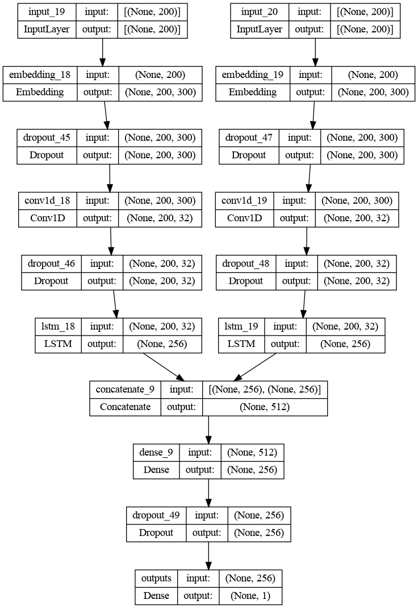
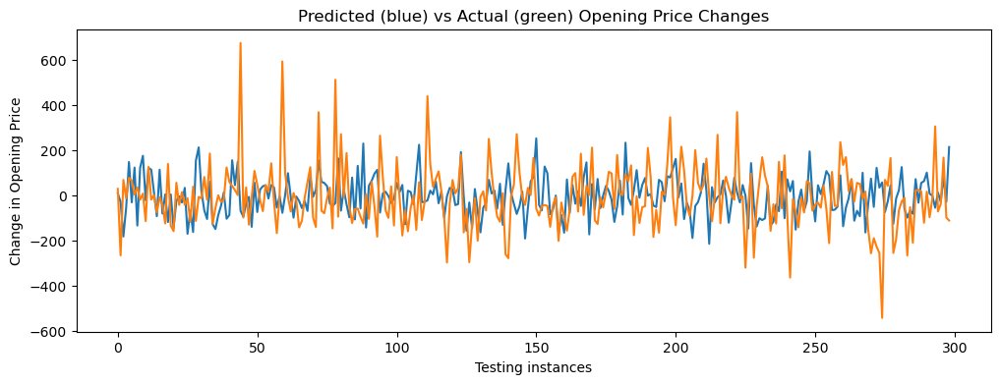
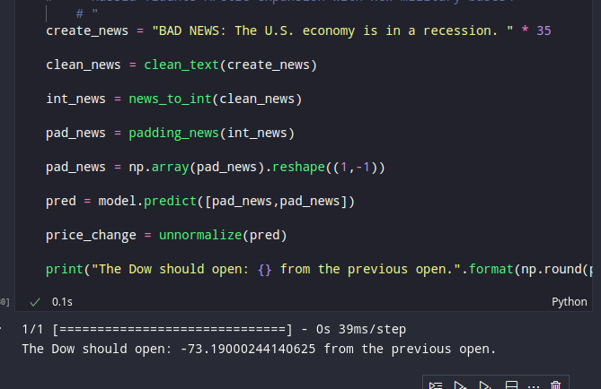
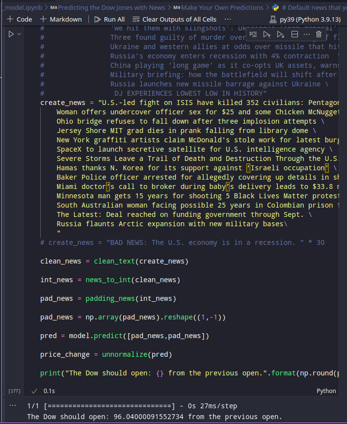

Предсказание цены акций на основе новостей
==============================

Using text classification models for stock price prediction. (MVP: Exchange rates)

## Как работает:

Эмбеддинги из новостей достаются с помощью GloVe модели (5.5гб весов pretrained), затем с помощью LSTM модели предсказывается цена акции. Более подробно модель и процесс обучения объясняются в оригинальной статье - [статья](https://medium.com/@Currie32/predicting-the-stock-market-with-the-news-and-deep-learning-7fc8f5f639bc)

## Что тут происходит:

- src/make_predict.py - скрипт для предсказания цены индекса DowJohnson на основе новостей (возвращает будет расти или падать и насколько)
- notebooks/0.1_model.py - ноутбук с обучением модели (там есть *красивые* картиночки)
- src/fetch_news.py - получение новостей с сайта Мосбиржи

## Зависимости:
- от хакатонов
- python 3.9
- keras, nltk, tensorflow
- веса glove модели

## Как запустить:

- Поскольку потребуются веса моделей, немного придется заморочиться. `final_questions_pairs...` лежит там где надо на гитхабе. glove весит в unzipнутом виде под 5.5гб, поэтому не включил в репозиторий. Надо скачать, делается это с помощью `make glove`.
- `make test_predict` позволяет проверить работу модели на тестовых данных
- Заметка: эти веса будут загружаться в вашу оперативную память или видеопамять, если будет не хватать может возникнуть неопределенное поведение.

## Перспектива модели:

- Аналогичный подход применим
для обучения модели на основани данных мосбиржи и изменении цен. И других связок
новости + цена акции в зависимости от даты и времени.

## Работоспособность модели:

Project Organization
------------

    ├── LICENSE
    ├── Makefile           <- Makefile with commands like `make data` or `make train`
    ├── README.md          <- The top-level README for developers using this project.
    ├── data
    │   ├── external       <- Data from third party sources.
    │   ├── interim        <- Intermediate data that has been transformed.
    │   ├── processed      <- The final, canonical data sets for modeling.
    │   └── raw            <- The original, immutable data dump.
    │
    ├── docs               <- A default Sphinx project; see sphinx-doc.org for details
    │
    ├── models             <- Trained and serialized models, model predictions, or model summaries
    │
    ├── notebooks          <- Jupyter notebooks. Naming convention is a number (for ordering),
    │                         the creator's initials, and a short `-` delimited description, e.g.
    │                         `1.0-jqp-initial-data-exploration`.
    │
    ├── references         <- Data dictionaries, manuals, and all other explanatory materials.
    │
    ├── reports            <- Generated analysis as HTML, PDF, LaTeX, etc.
    │   └── figures        <- Generated graphics and figures to be used in reporting
    │
    ├── requirements.txt   <- The requirements file for reproducing the analysis environment, e.g.
    │                         generated with `pip freeze > requirements.txt`
    │
    ├── setup.py           <- makes project pip installable (pip install -e .) so src can be imported
    ├── src                <- Source code for use in this project.
    │   ├── __init__.py    <- Makes src a Python module
    │   │
    │   ├── data           <- Scripts to download or generate data
    │   │   └── make_dataset.py
    │   │
    │   ├── features       <- Scripts to turn raw data into features for modeling
    │   │   └── build_features.py
    │   │
    │   ├── models         <- Scripts to train models and then use trained models to make
    │   │   │                 predictions
    │   │   ├── predict_model.py
    │   │   └── train_model.py
    │   │
    │   └── visualization  <- Scripts to create exploratory and results oriented visualizations
    │       └── visualize.py
    │
    └── tox.ini            <- tox file with settings for running tox; see tox.readthedocs.io

--------

<small>Project based on the <a target="_blank" href="https://drivendata.github.io/cookiecutter-data-science/">cookiecutter data science project template</a>. #cookiecutterdatascience</small>

